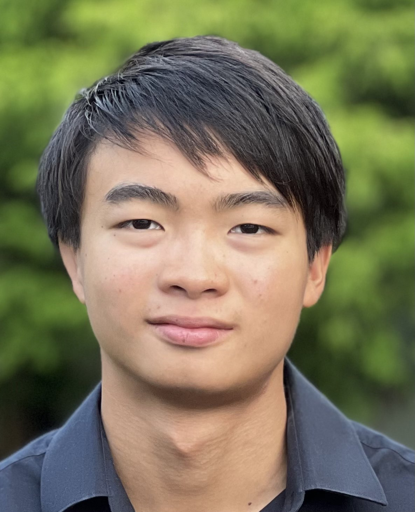

## About Me

Hello! I am an undergraduate studying Electrical and Computer Engineering at Cornell University. 

I'm drawn to the math and physics side of ECE - quantum computing, signal processing, and machine learning. I find the theoretical aspects of these fields enlightening. Beyond tools for engineering, they provide frameworks of thought that shape how I solve problems and think creatively about the world.

I currently do quantum computing and condensed matter research at the [Katz Lab](https://iontrap.aep.cornell.edu/).

For fun, I play the violin, read philosophy, and do boxing. I also grew up playing baseball (Go Yankees!).